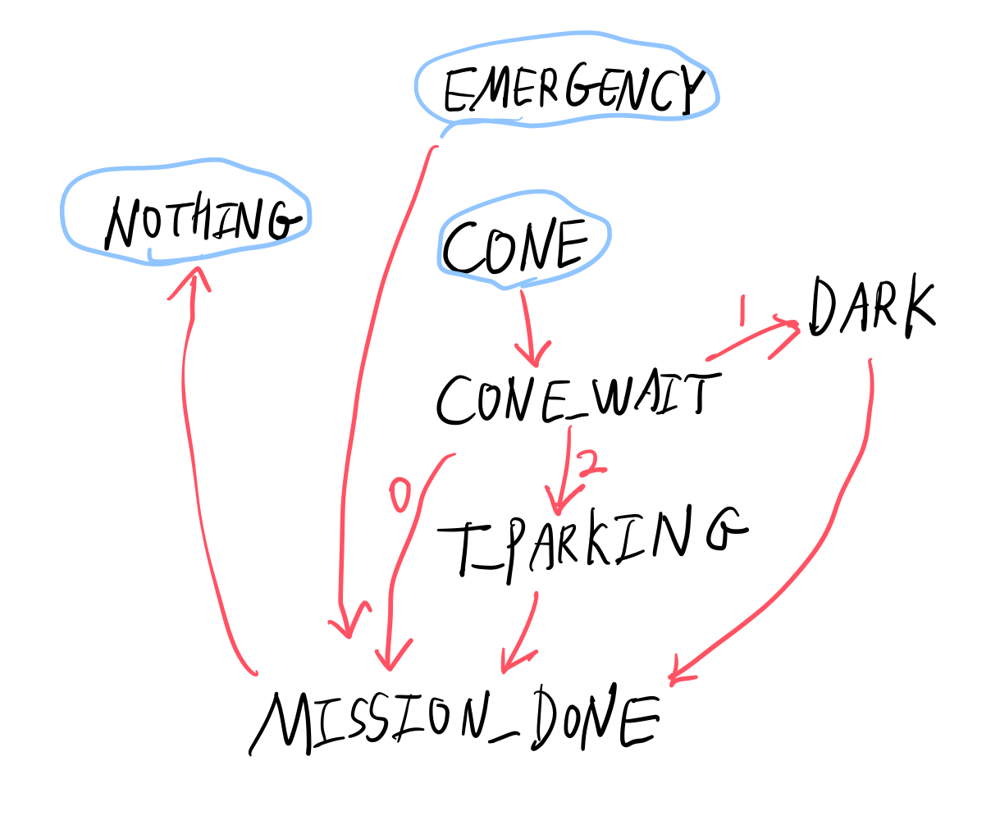

# Algorithm
## Left First
Linetracer follows the *left edge* of the line by keeping the right sensor on the line and the left sensor off the line. Specifically, it moves according to the following rule. (L/R is the detection of the two sensors.)
* not L and R - go forward
* L and R - turn left until not L
* not L and not R - turn right until R
* L and not R(exceptional case) - turn left until R

## Right First
Follows the right edge of the line by doing the opposite.

## Changing between left/right first
This happens when the RFID tag is tagged. It can be done easily if the line is not too wide.
* Changing from left first to right first-   Turn right until L is on line.
* Changing from right first to left first-   Turn left until R is on line.

## Mission
Linetracer checks for mission every 0.5s. The timing is done using the millis() function. The mission is handled by an FSM(Finite State Machine), where the current state is indicated by a flag named mission_state. The possible states and transitions of the FSM are shown in the following drawing.

