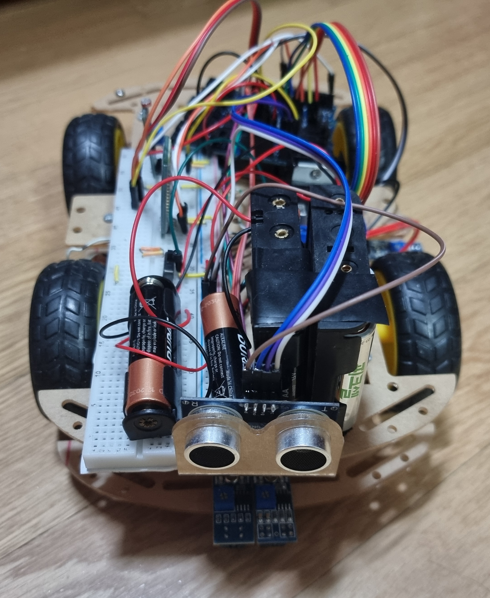
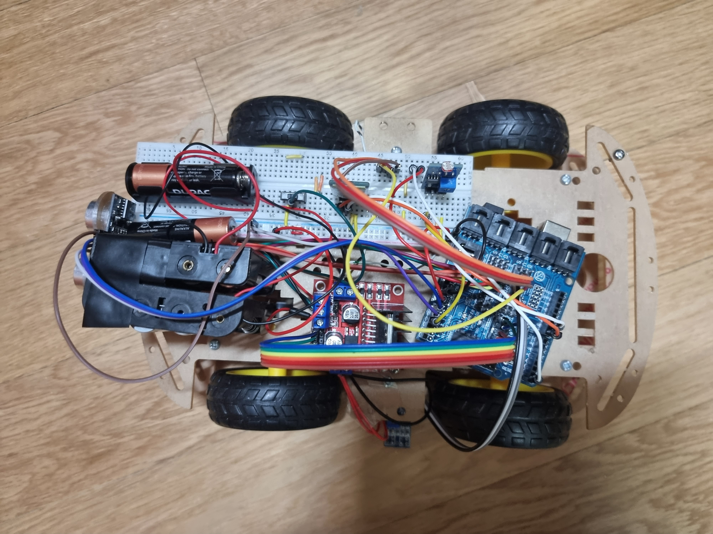

# Arduino Linetracer

 2021-2 창의공학설계 프로젝트 (SNU ECE Creative Engineering Design 2021 Fall)

## Description

This is the code of an Arduino line tracing car with 2+1 line tracing sensors. Line tracing is done using only two sensors.

The front two sensors were used for line tracing, and the third sensor attached on the left side of the car was used for an extra task(parking). Front two sensors were 14mm apart, which was as close as possible. Line was drawn with black tape and its width was about 30mm.

## Features
* Line tracing(including left(right)-first junction turn)
* Stops when cone is ahead
* RFID tag is used for mode switching
* Communication with android device via bluetooth module
* Parking which is very specific to the map provided

## Hardware
* Arduino Uno board
* 3 line tracer sensors
* L298N motor driver
* 4 DC motors
* Ultrasonic sensor
* HC-06 bluetooth module
* Light sensor
* RFID-RC522 reader

## Algorithm
[see here](Algorithm.md)

## Code
[main code is here](./main2/main2.ino)

## Images
front view

top view

Part of code inspired by
https://github.com/GyunghunKim/ArduinoLinetracer